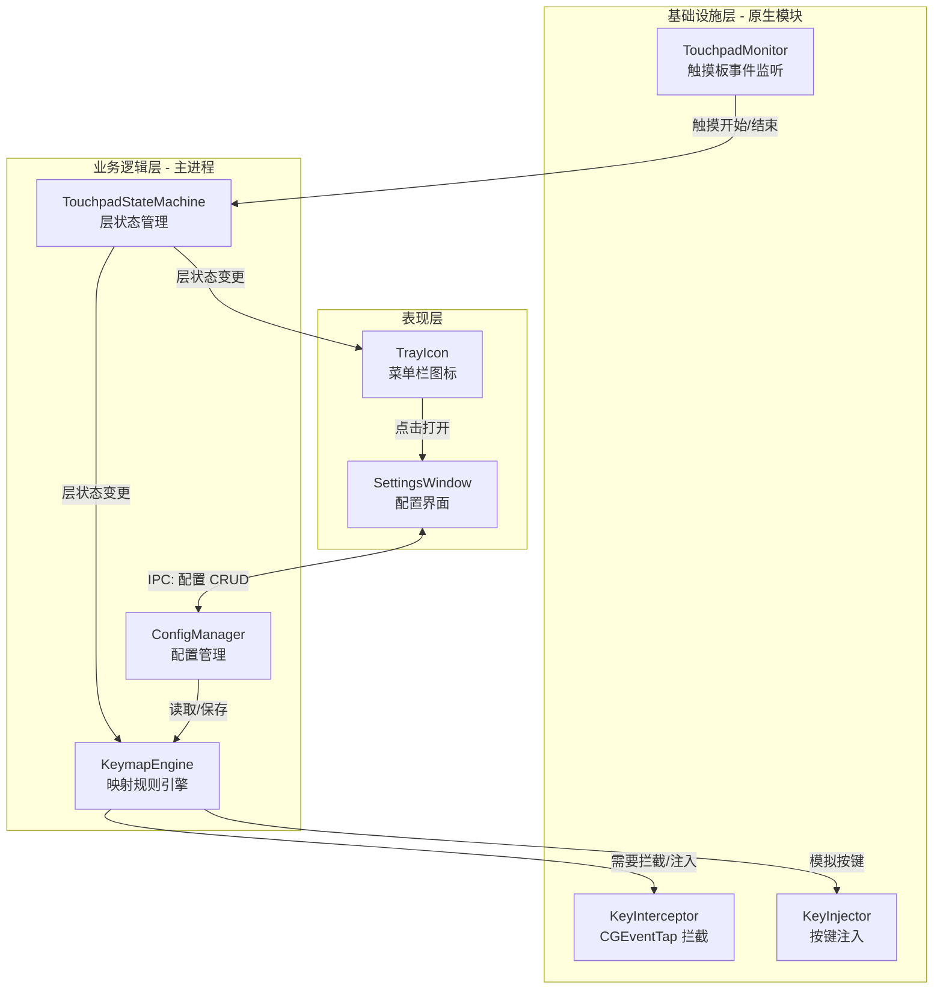
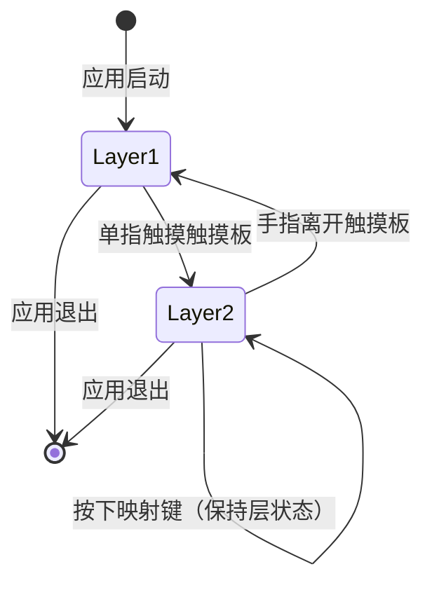

# touchpad-keymap-layer — TRD

> **变更目录**: `seedpacespec/changes/active-change/touchpad-keymap-layer/`
> **PRD**: `specs/touchpad-keymap-layer-prd.md`
> **design.md**: `design.md`（完整模式，已确认）
> **日期**: 2026-05-21 | **状态**: 待评审
> **输入上下文**: architecture.md ❌（推断）| design.md ✅ | 接口文档 ❌ | 测试用例 ❌

---

## 1. 概述

本文件描述 macOS Electron 触摸板按键层应用的技术实现方案。应用通过监听触摸板事件实现 Layer 1（正常键盘）与 Layer 2（自定义按键层）的状态切换，在 Layer 2 期间拦截并映射指定按键到方向键等功能。

**本 TRD 角色**: desktop-application (Electron + TypeScript + macOS Native)

**覆盖需求**: R01 ~ R05（全部需求）

**设计决策引用**（`design.md`）：

| 决策 | 级别 | 摘要 |
|------|------|------|
| D01 | 架构级 | 触摸板检测使用自定义 N-API 封装 IOKit — 直接采纳 |
| D02 | 架构级 | 按键拦截使用 CGEventTap 原生实现 — 直接采纳 |
| D03 | 模块级 | 状态机驱动映射引擎，主进程处理 — 直接采纳 |
| D04 | 模块级 | JSON 配置存储在 Application Support 目录 — 直接采纳 |
| D05 | 模块级 | 配置界面使用 Vanilla JS（保留 Vue 迁移路径）— 直接采纳 |

**TRD 补充决策**:

- **NATIVE-API-1**: 原生模块采用 N-API 而非 nan 或 node-addon-api。理由：N-API 是 Node.js 官方推荐的 ABI 稳定 API，Electron 版本升级时原生模块不需要重新编译，降低维护成本。
- **IPC-DESIGN-1**: 触摸板状态变更使用推送模式（主进程 → 渲染进程），而非渲染进程轮询。理由：状态变更是低频事件（手指放/离），推送模式减少 IPC 开销且延迟更低。
- **CONFIG-SCHEMA-1**: 配置文件使用 JSON Schema 校验，而非 TypeScript 类型运行时检查。理由：用户可能手动编辑配置文件，需要友好的错误提示；JSON Schema 可复用为配置界面表单校验规则。

**改动热区**:

- `src/native/` — 新增 3 个原生模块（C++/Obj-C++）
- `src/main/` — 状态机、映射引擎、配置管理器
- `src/renderer/settings/` — 配置界面
- `src/assets/icons/` — 菜单栏图标资源

---

## 2. 需求覆盖矩阵

| PRD 需求 | 简述 | TRD 章节 | 涉及模块/文件 | 决策引用 |
|----------|------|----------|---------------|----------|
| R01 | 触摸板层触发机制 | §4.1 基础设施层（原生模块） | TouchpadMonitor, 状态机 | D01 |
| R02 | 按键拦截与映射 | §4.1 基础设施层, §4.2 业务逻辑层 | KeyInterceptor, KeyInjector, 映射引擎 | D02, D03 |
| R03 | 配置持久化 | §4.2 业务逻辑层 | ConfigManager | D04 |
| R04 | 状态栏图标反馈 | §4.3 表现层 | TrayIcon, IPC 通道 | IPC-DESIGN-1 |
| R05 | 映射配置界面 | §4.3 表现层 | Settings UI, Config IPC | D05 |

---

## 3. 架构图示

### 3.1 模块交互图



### 3.2 状态流转图



---

## 4. 方案

> **分层来源**：本项目为全新 Electron 桌面应用，基于目标技术栈确定以下通用层：
> - **表现层**：用户界面（配置窗口、菜单栏图标）— 渲染进程
> - **业务逻辑层**：按键映射引擎、触摸板状态机、配置管理 — 主进程
> - **基础设施层**：原生模块封装、文件系统操作 — 主进程 + 原生模块

### 4.1 基础设施层 — 原生模块封装

> **层角色**：封装 macOS 低层 API（IOKit、CGEvent），提供 TypeScript 可调用的 N-API 接口
> **归属通用层**：基础设施层

#### 4.1.1 TouchpadMonitor（触摸板事件监听）

**覆盖**: R01 | **来源**: D01

**设计意图**:

本模块需要解决的核心问题：Electron 无法直接监听 macOS 触摸板原始事件，必须通过原生代码获取。选择封装为独立 N-API 模块而非使用现成库，是因为现成库（如 iohook）主要面向键盘鼠标，触摸板支持有限，无法满足「单指检测」的精确需求。

备选方案对比：
- **方案 A: 使用 NSEvent 全局监听** — 简单但只能获取应用焦点内事件，无法满足后台监听需求
- **方案 B: 使用 IOKit HID 接口** — 可以监听系统级触摸板事件，但代码复杂度高，需要处理设备枚举和事件解析
- **方案 C: 使用 private API (MTDevice)** — 提供最高级的触摸板数据（包括手指数量、位置），但依赖私有 API，有审核风险

最终选择 **方案 B（IOKit HID）** 为主方案，理由：
1. 系统级事件监听，支持应用后台运行
2. 可精确判断触摸点数量（单指 vs 多指）
3. 非私有 API，无 App Store 审核风险
4. 虽然开发复杂，但行为稳定可预期

不采用方案 C 的潜在后果：无法实现某些高级功能（如精确手势识别），但对于当前需求（单指检测）方案 B 已足够。

**接口定义**:

```typescript
// src/native/touchpad-monitor.d.ts
export interface TouchpadEvent {
  type: 'touch-start' | 'touch-end';
  timestamp: number;
  fingerCount: number;  // 当前触摸板上的手指数量
}

export class TouchpadMonitor {
  start(): void;
  stop(): void;
  on(event: 'touch', callback: (e: TouchpadEvent) => void): void;
  removeListener(event: 'touch', callback: Function): void;
}
```

**关键实现逻辑**（伪代码）:

```objc
// src/native/touchpad.mm
IOHIDManagerRef manager = IOHIDManagerCreate(kCFAllocatorDefault, kIOHIDOptionsTypeNone);

// 匹配触摸板设备 (Usage Page: 0x01, Usage: 0x02)
CFMutableDictionaryRef match = CFDictionaryCreateMutable(...);
CFDictionarySetValue(match, CFSTR(kIOHIDDeviceUsagePageKey), ...);
CFDictionarySetValue(match, CFSTR(kIOHIDDeviceUsageKey), ...);

IOHIDManagerSetDeviceMatching(manager, match);

// 注册输入回调
IOHIDManagerRegisterInputValueCallback(manager, 
  ^(void* context, IOReturn result, void* sender, IOHIDValueRef value) {
    IOHIDElementRef element = IOHIDValueGetElement(value);
    uint32_t usage = IOHIDElementGetUsage(element);
    
    // 解析手指数量（通过 usage 判断）
    int fingerCount = ParseFingerCount(usage, value);
    
    // 判断状态变化（单指开始/结束）
    if (fingerCount == 1 && previousCount == 0) {
      EmitEvent('touch-start', fingerCount);
    } else if (fingerCount == 0 && previousCount == 1) {
      EmitEvent('touch-end', fingerCount);
    }
    previousCount = fingerCount;
  }, 
  nullptr
);

IOHIDManagerScheduleWithRunLoop(manager, CFRunLoopGetMain(), kCFRunLoopDefaultMode);
IOHIDManagerOpen(manager, kIOHIDOptionsTypeNone);
```

**设计解读**：代码创建了 IOKit HID 管理器，设置触摸板设备匹配规则，然后注册输入值回调。在回调中解析 HID 元素的使用类型和值，提取当前触摸板上的手指数量。通过比较当前数量和上一次的数量，判断是「单指开始触摸」还是「单指离开」，然后触发对应的事件通知 Node.js 层。整个事件循环与主线程的 CFRunLoop 集成，确保回调在主线程执行（与 Node.js 事件循环兼容）。

#### 4.1.2 KeyInterceptor（按键事件拦截）

**覆盖**: R02 | **来源**: D02

**设计意图**:

本模块需要解决的问题：在 Layer 2 期间拦截物理键盘事件，阻止原始按键传递到系统。CGEventTap 是 macOS 上唯一能实现此能力的 API，但它需要在独立线程运行事件循环。

关键取舍：
- **CGEventTap 位置**：选择「进程级」而非「全局级」tap。理由：进程级 tap 只拦截本应用关注的按键，不影响其他应用，减少系统级副作用。
- **线程模型**：CGEventTap 必须在独立线程运行 CFRunLoop，与 Node.js 主线程分离。通过线程安全队列将事件异步传递到 Node.js 层。

**接口定义**:

```typescript
// src/native/key-interceptor.d.ts
export interface KeyEvent {
  keyCode: number;      // macOS 虚拟键码
  keyChar: string;      // 字符表示（如 'i', 'k'）
  isDown: boolean;      // true=按下, false=释放
  timestamp: number;
}

export class KeyInterceptor {
  start(): boolean;      // 返回是否成功（需 Accessibility 权限）
  stop(): void;
  on(event: 'keydown' | 'keyup', callback: (e: KeyEvent) => void): void;
  setInterceptFilter(filter: (e: KeyEvent) => boolean): void;
  // filter 返回 true=拦截（不传递到系统）, false=放行
}
```

**关键实现逻辑**（伪代码）:

```objc
// src/native/key_interceptor.mm
// 在独立线程创建 CGEventTap
CFRunLoopSourceRef runLoopSource;
dispatch_queue_t eventTapQueue = dispatch_queue_create("keytap.queue", DISPATCH_QUEUE_SERIAL);

dispatch_async(eventTapQueue, ^{
  // 创建进程级事件 tap
  CFMachPortRef tap = CGEventTapCreate(
    kCGSessionEventTap,
    kCGHeadInsertEventTap,
    kCGEventTapOptionDefault,
    CGEventMaskBit(kCGEventKeyDown) | CGEventMaskBit(kCGEventKeyUp),
    ^CGEventRef(CGEventTapProxy proxy, CGEventType type, CGEventRef event, void *refcon) {
      int64_t keyCode = CGEventGetIntegerValueField(event, kCGKeyboardEventKeycode);
      
      // 转换为 KeyEvent 结构
      KeyEvent ke = {
        .keyCode = (int)keyCode,
        .isDown = (type == kCGEventKeyDown),
        .timestamp = GetTimestamp()
      };
      
      // 调用 JS 层设置的 filter 回调（通过线程安全队列）
      bool shouldIntercept = InvokeJSFilter(ke);
      
      if (shouldIntercept) {
        // 拦截：不返回 event，系统收不到按键
        EmitToNodeJS(ke);  // 通知 Node.js 层处理
        return NULL;
      } else {
        // 放行：返回原始 event
        return event;
      }
    },
    nullptr
  );
  
  runLoopSource = CFMachPortCreateRunLoopSource(kCFAllocatorDefault, tap, 0);
  CFRunLoopAddSource(CFRunLoopGetCurrent(), runLoopSource, kCFRunLoopCommonModes);
  CGEventTapEnable(tap, true);
  CFRunLoopRun();
});
```

**设计解读**：代码在独立的 GCD 队列（线程）中创建 CGEventTap。事件回调中读取按键码，通过预先设置的 JavaScript filter 函数判断是否拦截。如果 filter 返回 true，回调返回 NULL（事件被「吃掉」，不传递给系统），同时通过线程安全队列通知 Node.js 层该按键被拦截。如果 filter 返回 false，返回原始 event，按键正常传递到系统。这种设计将耗时的 CGEventTap 事件循环与 Node.js 主线程隔离，通过队列异步通信，避免阻塞。

#### 4.1.3 KeyInjector（按键事件注入）

**覆盖**: R02 | **来源**: D02

**设计意图**:

本模块解决的问题：在拦截按键后，需要向系统注入映射后的按键事件（如将 'i' 注入为方向键 '↑'）。使用 `CGEventCreateKeyboardEvent` 创建事件后通过 `CGEventPost` 发送。

关键设计：
- **注入时机**：在 KeyInterceptor 的 filter 回调返回 NULL（拦截）后，由 Node.js 层调用 KeyInjector 注入新事件。两者解耦，避免原生层逻辑复杂化。
- **键码映射**：维护 macOS 虚拟键码表（如 kVK_UpArrow = 0x7E），将字符映射到对应键码。

**接口定义**:

```typescript
// src/native/key-injector.d.ts
export type KeyCode = string;  // 'up' | 'down' | 'left' | 'right' | 'home' | 'end' | ...

export class KeyInjector {
  // 注入单个按键（按下+释放）
  injectKey(keyCode: KeyCode): void;
  
  // 注入组合键（如需要扩展）
  injectCombo(modifiers: string[], keyCode: KeyCode): void;
}
```

**关键实现逻辑**（伪代码）:

```objc
// src/native/key_injector.mm
void KeyInjector::InjectKey(const char* keyName) {
  CGKeyCode keyCode = MapKeyNameToCode(keyName);  // 'up' -> 0x7E
  
  // 创建按下事件
  CGEventRef downEvent = CGEventCreateKeyboardEvent(nullptr, keyCode, true);
  CGEventPost(kCGSessionEventTap, downEvent);
  CFRelease(downEvent);
  
  // 短暂延迟（模拟真实按键间隔）
  usleep(10000);  // 10ms
  
  // 创建释放事件
  CGEventRef upEvent = CGEventCreateKeyboardEvent(nullptr, keyCode, false);
  CGEventPost(kCGSessionEventTap, upEvent);
  CFRelease(upEvent);
}

CGKeyCode MapKeyNameToCode(const char* name) {
  if (strcmp(name, "up") == 0) return 0x7E;
  if (strcmp(name, "down") == 0) return 0x7D;
  if (strcmp(name, "left") == 0) return 0x7B;
  if (strcmp(name, "right") == 0) return 0x7C;
  if (strcmp(name, "home") == 0) return 0x73;
  if (strcmp(name, "end") == 0) return 0x77;
  // ... 更多映射
}
```

**设计解读**：代码将字符串键名（如 'up'）映射到 macOS 虚拟键码（如 0x7E），然后使用 CGEventCreateKeyboardEvent 创建按下和释放两个事件，通过 CGEventPost 发送到系统事件流。添加了 10ms 延迟模拟真实按键的按下-释放间隔，避免某些应用将过快的按键识别为异常。

#### 4.1.4 本层内部公共单元

| 公共单元 | 类型 | 所属层 | 路径 | 被哪些模块复用 | 抽离理由 |
|----------|------|--------|------|----------------|----------|
| NAPI Utils | 工具函数 | 基础设施 | `src/native/utils.mm` | TouchpadMonitor, KeyInterceptor, KeyInjector | N-API 错误处理、线程安全队列封装 |
| macOS KeyCodes | 常量表 | 基础设施 | `src/native/keycodes.h` | KeyInterceptor, KeyInjector | 统一 macOS 虚拟键码定义 |

---

### 4.2 业务逻辑层 — 主进程逻辑

> **层角色**：处理触摸板状态管理、按键映射规则匹配、配置持久化
> **归属通用层**：业务逻辑层

#### 4.2.1 TouchpadStateMachine（触摸板状态机）

**覆盖**: R01 | **来源**: D03

**设计意图**:

本模块的核心问题：管理 Layer 1（正常）与 Layer 2（自定义层）的状态转换，确保状态变更及时通知到所有相关模块（映射引擎、菜单栏图标）。

状态机设计：
- **状态定义**：Layer1（空闲）、Layer2（触摸中）
- **触发事件**：touch-start（单指触摸）、touch-end（手指离开）
- **状态动作**：进入 Layer2 时更新全局状态并通知订阅者；进入 Layer1 时恢复状态

选择有限状态机而非简单布尔变量的理由：
1. 语义清晰，状态转换路径明确
2. 易于扩展（后续若支持多场景层，可扩展为多层状态机）
3. 支持状态进入/退出的钩子（如 Layer2 进入时播放提示音）

**接口定义**:

```typescript
// src/main/state-machine/touchpad-state.ts
export type LayerState = 'layer1' | 'layer2';

export interface StateContext {
  currentLayer: LayerState;
  touchStartTime?: number;  // 触摸开始时间（用于后续扩展长按检测）
}

export class TouchpadStateMachine {
  private state: StateContext;
  private listeners: Set<(state: LayerState) => void>;
  
  constructor();
  
  // 状态转换
  transition(event: 'touch-start' | 'touch-end'): void;
  
  // 查询当前状态
  getCurrentLayer(): LayerState;
  
  // 订阅状态变更
  onStateChange(callback: (state: LayerState) => void): () => void;
}
```

**关键实现逻辑**（伪代码）:

```typescript
// src/main/state-machine/touchpad-state.ts
class TouchpadStateMachine {
  private state: StateContext = { currentLayer: 'layer1' };
  private listeners = new Set<(state: LayerState) => void>();

  transition(event: 'touch-start' | 'touch-end') {
    const prevState = this.state.currentLayer;
    
    switch (event) {
      case 'touch-start':
        if (prevState === 'layer1') {
          this.state = { 
            currentLayer: 'layer2', 
            touchStartTime: Date.now() 
          };
          this.emit('layer2');
        }
        break;
        
      case 'touch-end':
        if (prevState === 'layer2') {
          this.state = { currentLayer: 'layer1' };
          this.emit('layer1');
        }
        break;
    }
  }

  private emit(newState: LayerState) {
    this.listeners.forEach(cb => {
      try {
        cb(newState);
      } catch (err) {
        logger.error('State listener error:', err);
      }
    });
  }
}
```

**设计解读**：状态机使用简单的 switch 处理两种事件（touch-start/end），在状态真正发生变更时通知所有订阅者。错误处理采用 try-catch 包裹回调执行，防止某个监听器的异常导致其他监听器收不到通知。状态变更同步执行，确保在触摸板事件处理期间状态已就绪，后续按键拦截可以立即查询到正确状态。

#### 4.2.2 KeymapEngine（按键映射引擎）

**覆盖**: R02 | **来源**: D03

**设计意图**:

本模块解决的问题：在 Layer 2 期间，根据配置的映射规则，决定是否拦截按键并注入映射后的按键。

核心设计决策：
- **规则存储**：使用 Map<string, KeyMapping>（源键 → 目标键），查询 O(1)
- **拦截决策**：在 KeyInterceptor 的 filter 回调中调用 KeymapEngine.shouldIntercept(keyCode, layerState)
- **映射执行**：拦截后调用 KeyInjector 注入目标按键

为什么不把映射逻辑直接写在 KeyInterceptor 的原生代码里？
- 映射规则需要动态加载（从配置文件），原生层难以实现灵活的配置管理
- TypeScript 层更易维护复杂的规则逻辑（如后续扩展的条件映射）

**接口定义**:

```typescript
// src/main/keymap/engine.ts
export interface KeyMapping {
  from: string;      // 源键（如 'i'）
  to: string;        // 目标键（如 'up'）
  toType: 'key' | 'command';  // 当前仅支持 'key'
}

export class KeymapEngine {
  private rules: Map<string, KeyMapping>;
  private stateMachine: TouchpadStateMachine;
  private interceptor: KeyInterceptor;
  private injector: KeyInjector;
  
  constructor(
    stateMachine: TouchpadStateMachine,
    interceptor: KeyInterceptor,
    injector: KeyInjector
  );
  
  // 加载/重载映射规则
  loadRules(rules: KeyMapping[]): void;
  
  // 判断是否应该拦截（供 KeyInterceptor filter 调用）
  shouldIntercept(keyCode: string, currentLayer: LayerState): boolean;
  
  // 执行映射（拦截后调用）
  executeMapping(fromKey: string): void;
  
  // 启用/禁用引擎
  enable(): void;
  disable(): void;
}
```

**关键实现逻辑**（伪代码）:

```typescript
// src/main/keymap/engine.ts
class KeymapEngine {
  private rules = new Map<string, KeyMapping>();
  private enabled = false;

  constructor(
    private stateMachine: TouchpadStateMachine,
    private interceptor: KeyInterceptor,
    private injector: KeyInjector
  ) {
    // 设置拦截器的 filter 回调
    this.interceptor.setInterceptFilter((event) => {
      if (!this.enabled) return false;
      
      const currentLayer = this.stateMachine.getCurrentLayer();
      const keyChar = this.keyCodeToChar(event.keyCode);
      
      // 只有在 Layer2 且该键有映射规则时才拦截
      return currentLayer === 'layer2' && this.rules.has(keyChar);
    });

    // 监听拦截事件
    this.interceptor.on('keydown', (event) => {
      const keyChar = this.keyCodeToChar(event.keyCode);
      this.executeMapping(keyChar);
    });
  }

  loadRules(rules: KeyMapping[]) {
    this.rules.clear();
    for (const rule of rules) {
      this.rules.set(rule.from, rule);
    }
  }

  executeMapping(fromKey: string) {
    const rule = this.rules.get(fromKey);
    if (!rule) return;
    
    if (rule.toType === 'key') {
      this.injector.injectKey(rule.to);
    }
    // 后续扩展：command 类型执行系统命令
  }

  private keyCodeToChar(keyCode: number): string {
    // macOS 虚拟键码到字符的映射表
    const map: Record<number, string> = {
      0x22: 'i', 0x28: 'k', 0x26: 'j', 0x25: 'l',
      0x20: 'u', 0x18: 'o',
      // ... 更多映射
    };
    return map[keyCode] || '';
  }
}
```

**设计解读**：引擎在构造函数中设置 KeyInterceptor 的 filter 回调，实现拦截决策的集中管理。filter 中查询当前层状态，只有在 Layer2 且按键有映射规则时才返回 true（拦截）。拦截后的事件触发 keydown 回调，引擎查找映射规则并调用 KeyInjector 注入目标按键。规则使用 Map 存储，支持 O(1) 查询和热重载（loadRules 方法）。

#### 4.2.3 ConfigManager（配置管理器）

**覆盖**: R03 | **来源**: D04

**设计意图**:

本模块解决的问题：映射规则的持久化存储、JSON Schema 验证、配置热重载。

关键决策：
- **存储位置**：`~/Library/Application Support/touchpad-keymap-layer/config.json`
- **文件格式**：JSON，人类可读便于手动编辑
- **验证策略**：使用 JSON Schema 校验，校验失败时回退到默认配置并备份错误文件
- **热重载**：监听文件变更（fs.watch），变更后重新加载并通知映射引擎

为什么不使用 Electron Store 或类似库？
- 需要配置文件人类可读（JSON），而非二进制或 obfuscate 格式
- 用户可能有版本控制或手动编辑需求

**接口定义**:

```typescript
// src/main/config/manager.ts
export interface AppConfig {
  version: number;
  mappings: KeyMapping[];
  settings: {
    launchAtLogin: boolean;
    showLayerIndicator: boolean;
    // 后续扩展
  };
}

export class ConfigManager {
  private configPath: string;
  private currentConfig: AppConfig;
  private watchers: Set<(config: AppConfig) => void>;
  
  constructor();
  
  // 初始化：加载配置，若不存在则创建默认配置
  initialize(): Promise<void>;
  
  // 获取当前配置
  getConfig(): AppConfig;
  
  // 更新配置（完整替换）
  saveConfig(config: AppConfig): Promise<void>;
  
  // 增量更新映射规则
  updateMappings(mappings: KeyMapping[]): Promise<void>;
  
  // 订阅配置变更
  onConfigChange(callback: (config: AppConfig) => void): () => void;
  
  // 重置为默认配置
  resetToDefault(): Promise<void>;
}
```

**关键实现逻辑**（伪代码）:

```typescript
// src/main/config/manager.ts
class ConfigManager {
  private configPath: string;
  private currentConfig: AppConfig;

  async initialize() {
    this.configPath = path.join(
      app.getPath('userData'),
      'config.json'
    );

    // 配置文件不存在则创建默认配置
    if (!fs.existsSync(this.configPath)) {
      await this.saveConfig(getDefaultConfig());
    }

    await this.loadConfig();
    
    // 监听文件变更实现热重载
    fs.watch(this.configPath, (eventType) => {
      if (eventType === 'change') {
        this.loadConfig().catch(err => {
          logger.error('Config reload failed:', err);
        });
      }
    });
  }

  private async loadConfig() {
    try {
      const content = await fs.promises.readFile(this.configPath, 'utf-8');
      const parsed = JSON.parse(content);
      
      // JSON Schema 验证
      const valid = validateConfig(parsed);
      if (!valid) {
        throw new Error('Config validation failed');
      }
      
      this.currentConfig = parsed;
      this.emitChange();
    } catch (err) {
      logger.error('Config load error:', err);
      // 回退到默认配置，备份错误文件
      this.currentConfig = getDefaultConfig();
      await this.backupAndReset();
    }
  }

  async saveConfig(config: AppConfig) {
    // 验证后再保存
    const valid = validateConfig(config);
    if (!valid) {
      throw new Error('Config validation failed');
    }
    
    await fs.promises.writeFile(
      this.configPath,
      JSON.stringify(config, null, 2),
      'utf-8'
    );
    this.currentConfig = config;
  }
}

// 默认配置
function getDefaultConfig(): AppConfig {
  return {
    version: 1,
    mappings: [
      { from: 'i', to: 'up', toType: 'key' },
      { from: 'k', to: 'down', toType: 'key' },
      { from: 'j', to: 'left', toType: 'key' },
      { from: 'l', to: 'right', toType: 'key' },
      { from: 'u', to: 'home', toType: 'key' },
      { from: 'o', to: 'end', toType: 'key' },
    ],
    settings: {
      launchAtLogin: false,
      showLayerIndicator: true,
    }
  };
}
```

**设计解读**：配置管理器在初始化时检查配置文件是否存在，不存在则创建默认配置。使用 fs.watch 监听文件变更，实现配置热重载（用户手动编辑文件后自动生效）。加载时进行 JSON Schema 验证，验证失败则回退到默认配置并备份错误文件，确保应用始终可用。保存配置时也进行验证，防止写入无效配置。

#### 4.2.4 本层内部公共单元

| 公共单元 | 类型 | 所属层 | 路径 | 被哪些模块复用 | 抽离理由 |
|----------|------|--------|------|----------------|----------|
| IPC Channel Defs | 常量 | 业务逻辑 | `src/common/ipc-channels.ts` | 主进程、渲染进程 | 统一 IPC 通道命名，避免硬编码字符串 |
| Logger | 工具类 | 业务逻辑 | `src/main/utils/logger.ts` | 所有主进程模块 | 统一日志格式，支持文件轮转 |
| KeyCode Mapper | 工具函数 | 业务逻辑 | `src/main/utils/keycode-mapper.ts` | KeymapEngine, ConfigManager | macOS 虚拟键码与字符互转 |

---

### 4.3 表现层 — 用户界面

> **层角色**：提供配置界面和菜单栏图标交互
> **归属通用层**：表现层

#### 4.3.1 TrayIcon（菜单栏图标）

**覆盖**: R04 | **来源**: IPC-DESIGN-1

**设计意图**:

本模块解决的问题：在 macOS 菜单栏显示应用图标，根据层状态切换图标样式，提供应用入口菜单。

关键设计：
- **图标资源**：两套图标（默认灰色、激活蓝色），每套含 1x/2x 版本适配 Retina
- **状态同步**：主进程通过 IPC 推送层状态变更，渲染进程无需轮询
- **点击菜单**：左键点击打开配置窗口，右键显示菜单（显示配置、退出等）

**接口定义**:

```typescript
// src/main/tray/icon.ts
export class TrayIcon {
  constructor(
    private onShowSettings: () => void,
    private onQuit: () => void
  );
  
  // 创建菜单栏图标
  create(): void;
  
  // 更新层状态（切换图标）
  setLayerState(state: LayerState): void;
  
  // 销毁图标
  destroy(): void;
}
```

**关键实现逻辑**（伪代码）:

```typescript
// src/main/tray/icon.ts
class TrayIcon {
  private tray: Tray | null = null;
  private icons: {
    default: NativeImage;
    active: NativeImage;
  };

  constructor(
    private onShowSettings: () => void,
    private onQuit: () => void
  ) {
    // 加载图标资源
    this.icons = {
      default: nativeImage.createFromPath(
        path.join(__dirname, '../../assets/icons/tray-template.png')
      ),
      active: nativeImage.createFromPath(
        path.join(__dirname, '../../assets/icons/tray-active.png')
      )
    };
    
    // 设置为模板图标（适配深色模式）
    this.icons.default.setTemplateImage(true);
  }

  create() {
    this.tray = new Tray(this.icons.default);
    
    // 左键点击打开配置
    this.tray.on('click', () => {
      this.onShowSettings();
    });
    
    // 右键菜单
    const contextMenu = Menu.buildFromTemplate([
      { label: '设置...', click: () => this.onShowSettings() },
      { type: 'separator' },
      { label: '退出', click: () => this.onQuit() }
    ]);
    this.tray.setContextMenu(contextMenu);
  }

  setLayerState(state: LayerState) {
    if (!this.tray) return;
    
    const icon = state === 'layer2' ? this.icons.active : this.icons.default;
    this.tray.setImage(icon);
  }
}
```

**设计解读**：代码加载两套图标资源，默认图标设为模板图片（setTemplateImage），使其在 macOS 深色/浅色模式下自动反色。左键点击触发打开配置窗口回调，右键显示上下文菜单。setLayerState 方法根据当前层状态切换图标，在 Layer2 时显示激活状态图标，提供直观的视觉反馈。

#### 4.3.2 SettingsWindow（配置界面）

**覆盖**: R05 | **来源**: D05

**设计意图**:

本模块解决的问题：提供可视化界面管理映射规则（增删改查）。

界面设计：
- **布局**：列表展示现有规则 + 底部添加按钮
- **列表项**：显示「源键 → 目标键」，右侧编辑/删除按钮
- **添加/编辑**：弹窗表单，按键捕获输入（监听键盘输入显示按键名）
- **重置**：一键恢复默认映射

技术选择：
- 使用 Vanilla JS + 轻量 DOM 操作，保持简单
- 组件结构预留 Vue 迁移路径（数据与视图分离）

**接口定义**:

```typescript
// src/main/window/settings.ts
export class SettingsWindow {
  private window: BrowserWindow | null = null;
  
  constructor(
    private configManager: ConfigManager,
    private keymapEngine: KeymapEngine
  );
  
  // 显示配置窗口（若未创建则创建，若已隐藏则显示）
  show(): void;
  
  // 隐藏窗口
  hide(): void;
  
  // 销毁窗口
  destroy(): void;
}
```

**渲染进程接口**:

```typescript
// src/renderer/settings/index.ts
// 暴露给渲染进程的 Electron API
interface SettingsAPI {
  // 获取当前配置
  getConfig(): Promise<AppConfig>;
  
  // 保存配置
  saveConfig(config: AppConfig): Promise<void>;
  
  // 捕获按键（用于添加映射时捕获用户按键）
  captureKey(): Promise<string>;
  
  // 重置为默认
  resetToDefault(): Promise<void>;
}

// 声明全局 window.api
declare global {
  interface Window {
    api: SettingsAPI;
  }
}
```

**关键实现逻辑**（伪代码）:

```typescript
// src/main/window/settings.ts
class SettingsWindow {
  private window: BrowserWindow | null = null;

  constructor(
    private configManager: ConfigManager,
    private keymapEngine: KeymapEngine
  ) {
    // 监听配置变更，推送到渲染进程
    this.configManager.onConfigChange((config) => {
      this.window?.webContents.send('config-updated', config);
    });
  }

  show() {
    if (this.window) {
      this.window.show();
      return;
    }

    this.window = new BrowserWindow({
      width: 500,
      height: 600,
      resizable: false,
      minimizable: false,
      maximizable: false,
      webPreferences: {
        preload: path.join(__dirname, 'preload.js'),
        contextIsolation: true,
        nodeIntegration: false
      }
    });

    this.window.loadFile(path.join(__dirname, '../../renderer/settings.html'));
    
    // 关闭时销毁引用
    this.window.on('closed', () => {
      this.window = null;
    });
  }
}

// src/main/window/preload.ts - 预加载脚本
import { contextBridge, ipcRenderer } from 'electron';

contextBridge.exposeInMainWorld('api', {
  getConfig: () => ipcRenderer.invoke('config:get'),
  saveConfig: (config) => ipcRenderer.invoke('config:save', config),
  resetToDefault: () => ipcRenderer.invoke('config:reset'),
  
  // 监听配置变更
  onConfigUpdate: (callback) => {
    ipcRenderer.on('config-updated', (_, config) => callback(config));
  }
});
```

**设计解读**：配置窗口使用 Electron 的 BrowserWindow 创建，启用预加载脚本（preload）进行上下文隔离。通过 contextBridge 暴露安全的 API 给渲染进程，渲染进程无法直接访问 Node.js 或 Electron 内部 API。主进程监听配置变更事件，通过 IPC 推送到渲染进程，实现配置的实时同步。窗口设置为固定尺寸，作为工具型窗口的典型设计。

#### 4.3.3 本层内部公共单元

| 公共单元 | 类型 | 所属层 | 路径 | 被哪些模块复用 | 抽离理由 |
|----------|------|--------|------|----------------|----------|
| Button Component | UI 组件 | 表现层 | `src/renderer/settings/components/button.ts` | 配置界面各按钮 | 统一样式，避免重复 CSS |
| Form Input | UI 组件 | 表现层 | `src/renderer/settings/components/input.ts` | 映射表单 | 统一输入框样式和行为 |
| Common Styles | CSS | 表现层 | `src/renderer/settings/styles.css` | 所有界面组件 | 统一视觉风格 |

---

## 5. 风险与约束

### 5.1 风险表

| 风险 | 来源 | 影响 §4.x | 缓解 |
|------|------|-----------|------|
| macOS 版本兼容性 | C01 | §4.1 | 在 10.15 (Catalina)、11+ (Big Sur+) 测试；使用向后兼容的 IOKit API |
| Accessibility 权限被拒 | C02 | 全部 | 启动时检测权限状态，未授权时显示引导对话框，提供跳转系统设置按钮 |
| CGEventTap 线程崩溃 | 设计 | §4.1.2 | 原生模块添加异常边界；主进程捕获未处理异常并重启原生模块；错误日志上报 |
| 触摸板检测误判 | 设计 | §4.2.1 | 严格判断手指数量；添加日志记录误判场景用于后续优化 |
| 按键注入被安全软件拦截 | 外部 | §4.1.3 | 引导用户添加应用白名单；提供诊断工具检查注入状态 |
| 配置文件损坏 | 设计 | §4.2.3 | 加载时 try-catch，损坏时自动重置默认并备份旧文件 |
| 内存泄漏（原生模块） | 设计 | §4.1 | 使用智能指针管理 Objective-C 对象；定期压力测试检查内存占用 |
| Electron 版本升级 API 变更 | 外部 | 全部 | 锁定 Electron 版本；升级前阅读 changelog；N-API 提供 ABI 稳定性 |

### 5.2 待确认项

- [ ] Q1: 触摸板检测在 MacBook 内置触摸板和 Magic Trackpad 上是否行为一致？→ 影响 §4.1.1
- [ ] Q2: 是否需要在配置界面提供「暂停层切换」的临时禁用功能？→ 影响 §4.2.1

### 5.3 缺失上下文

| 缺失项 | 影响 | 降级策略 | 补充指引 |
|--------|------|----------|----------|
| architecture.md | 分层命名 | 使用软件设计理论标准分层（表现层/业务逻辑层/基础设施层） | 后续项目迭代时补充 architecture.md |
| 接口文档 | 不适用 | 无外部 API 调用 | — |
| 测试用例 | §6 测试场景 | 基于 PRD 验收标准推导测试场景 | QA 阶段补充详细测试用例 |

---

## 6. 测试要点

| 场景 | 关联 §4.x | 关联风险 | 验证目标 |
|------|-----------|----------|----------|
| 单指触摸进入 Layer2 | §4.1.1, §4.2.1 | 触摸板检测误判 | 菜单栏图标变为激活状态；按下 i/k/j/l 触发方向键 |
| 手指离开返回 Layer1 | §4.1.1, §4.2.1 | 触摸板检测误判 | 菜单栏图标恢复默认；i/k/j/l 正常输入字母 |
| 多指触摸不触发 Layer2 | §4.1.1 | 触摸板检测误判 | 双指/三指触摸时状态不变，防止误触 |
| 配置界面增删改映射 | §4.2.3, §4.3.2 | 配置文件损坏 | 修改后写入 JSON；重启应用后配置保留 |
| 配置文件损坏恢复 | §4.2.3 | 配置文件损坏 | 手动写入无效 JSON，应用启动时自动恢复默认 |
| Accessibility 权限缺失 | 全部 | 权限被拒 | 应用启动时提示授权引导；未授权时功能不可用但应用不崩溃 |
| 长时间运行稳定性 | §4.1 | 内存泄漏 | 持续运行 24 小时，内存占用稳定 |
| 深色/浅色模式切换 | §4.3.1 | 无 | 系统主题切换时菜单栏图标自适应 |

---

## 7. 变更记录

| 日期 | 版本 | 变更 |
|------|------|------|
| 2026-05-21 | v1.0 | 初始 TRD，覆盖 R01~R05 |

---

## 附：默认映射规则

```json
{
  "mappings": [
    { "from": "i", "to": "up", "toType": "key" },
    { "from": "k", "to": "down", "toType": "key" },
    { "from": "j", "to": "left", "toType": "key" },
    { "from": "l", "to": "right", "toType": "key" },
    { "from": "u", "to": "home", "toType": "key" },
    { "from": "o", "to": "end", "toType": "key" }
  ]
}
```

<!-- sdx:status=confirmed -->
